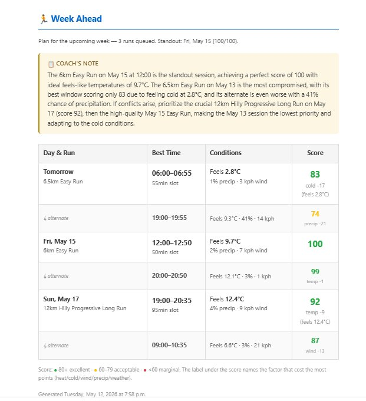
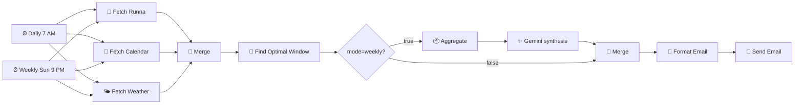

# 🏃 RunBot

> An n8n workflow that picks optimal running windows from your Runna training plan, calendar conflicts, and the weather forecast. Emailed daily and weekly with LLM-generated coaching commentary.

## What it does

Every weekday morning at 7 AM, an email lands in your inbox with the best time to run today — scored 0–100 against feels-like temperature, wind, precipitation, and weather conditions, with your calendar conflicts already filtered out. Every Sunday at 9 PM, a digest covers the upcoming week with a synthesis from Gemini ("The Tuesday Strength session is your standout. Prioritize the Sunday Long Run at 19:00 over the alternate at 21 kph wind…").

The scoring isn't generic. Each run type — Easy, Long, Tempo, Intervals, Strength, Hill Repeats, Progression, Fartlek, Rolling 400s, Time Trial — has its own ideal-temperature center and tolerance band. Long Runs penalize warmth more aggressively than Easy runs because heat compounds over distance.

## Why this exists

I run with [Runna](https://runna.com) and they sync my training plan to Google Calendar automatically. Knowing *what* to run on a given day is solved. *When* to run it isn't — that's a function of weather, daylight, work meetings, and how the specific session reacts to conditions. Doing that math in my head every morning was tedious, and Runna's default "9 AM Sunday for the Long Run" suggestion didn't account for the 28 kph headwind I'd been dreading all week.

So this does it.

## Architecture

Three Code nodes carry the logic — the rest are off-the-shelf n8n nodes (Schedule, Google Calendar, HTTP Request, Merge, IF, Gmail, Gemini).

## Setup

### Prerequisites

- **n8n** — Cloud or self-hosted, recent version (tested on 1.x)
- **Google account** with Calendar + Gmail OAuth access
- **Runna training plan** synced to Google Calendar — Runna handles this automatically once you enable it in Settings → Calendar Sync
- **Gemini API key** — free tier is fine. Grab one at [aistudio.google.com/apikey](https://aistudio.google.com/apikey). Only used once a week for the coaching note; if you don't want this, skip the IF/Aggregate/Gemini branch entirely

### Import the workflow

1. Clone or download this repo
2. In n8n: **Workflows → Add Workflow → Import from File** → pick `workflow.json`
3. The workflow imports with **red borders** on every node that needs credentials. Open each red-bordered node and connect your credentials:
   - `Fetch Runna Events`, `Fetch General Calendar` → Google Calendar OAuth
   - `Send Recommendation Email`, `Workflow failed` → Gmail OAuth
   - `Gemini-Agent` → Google Gemini API key

### Configure your personal constants

These five values are mine and need to become yours. All edits are in the Code node `Find Optimal Running Window` unless noted:

| What | Where | Default |
|---|---|---|
| Timezone | `const TZ` near the top | `'America/Montreal'` |
| Coordinates | `Fetch Weather Forecast` node URL (`latitude=…&longitude=…`) | `XX.XXXX, YY.YYYY` (Montréal) |
| Email recipient | `Send Recommendation Email` and `Workflow failed` nodes, "To" field | placeholder |
| Calendar names | `Fetch Runna Events` and `Fetch General Calendar` nodes | your calendar IDs |
| Schedule | `Daily at 8:00 AM` and `Weekly trigger` Schedule Trigger nodes | weekdays 7 AM, Sundays 9 PM |

### Activate

Toggle the workflow active in the top-right. Schedule triggers fire automatically. To test manually before waiting for the next scheduled run: **right-click on a specific Schedule Trigger node → Execute step**. Don't use "Test workflow" at the top — it fires both triggers simultaneously and you'll get duplicate emails. (Ask me how I learned this.)

## How the scoring works

Four factors each deduct from a starting score of 100. The full math is in [`docs/scoring-model.md`](docs/scoring-model.md). Open [`docs/scoring-visualizer.html`](docs/scoring-visualizer.html) in your browser for interactive Plotly charts of each penalty curve plus a scenario builder.

| Factor | Logic |
|---|---|
| **Temperature** | Asymmetric band around a research-aligned `feelsIdeal` (7–10°C depending on intensity). Zero penalty in a 20% dead-zone around ideal, gradient up to 12 at band edges, continues steeper outside. |
| **Wind** | Soft regime above 8 kph at 1 point/kph. Harsh regime above 25 kph at 1.5 points/kph, continuing from 17 (where soft ends) — no discontinuity. |
| **Precipitation** | Soft above 15% at 0.8 points/percent. Harsh above 40% at the same slope, continuing from 20. |
| **Weather code** | Discrete penalty by WMO code: fog −5, drizzle −15, rain −30, heavy/freezing rain −45, thunderstorm −100. |

Each window also reports its **worst factor** — the single deduction that cost the most points — so you can see at a glance why a 92 is a 92.

## Customization

The most likely things you'll want to tune for your own situation:

- **Run-type rules** — `TYPE_RULES` in `Find Optimal Running Window`. Each type has `feelsMin`/`feelsMax`/`feelsIdeal`/`bufferMin`. Lower the `feelsMax` of `Easy` if you find 15°C already warm; raise it if you're heat-acclimatized.
- **Earliest/latest run hours** — `PREFS.earliestHour` (6) and `PREFS.latestHour` (21). Probably want tighter bounds in winter when daylight is limited.
- **Schedule cadence** — the two Schedule Trigger nodes.
- **Score-color thresholds** — in `Format Email`, `fmtScoreColor` defines 80+/60–79/<60 as green/yellow/red.

## Caveats

- **Runna has no public API.** This depends on their Google Calendar sync, which they could restructure unilaterally. If runs stop being detected, check that the calendar still syncs and that titles still match the regex `/Easy|Long|Tempo|.../`.
- **Open-Meteo's free tier is non-commercial.** Fine for personal use; switch to their paid tier if you ever build something commercial on top.
- **Gemini free tier doesn't include Pro models.** The workflow uses `gemini-2.5-flash`, which is on the free tier and produces solid synthesis for once-a-week use. If you upgrade to Pro you'll need billing on your Google Cloud project.
- **The mode-detection in `Find Optimal Running Window` checks which Schedule Trigger fired.** If you rename a trigger node, update the `triggerFired()` calls accordingly.

## Story

The scoring model went through three iterations to get something genuinely useful:

1. **v1 — binary thresholds.** Anything within "acceptable" got full marks, anything outside got penalized. Result: every May-in-Montréal hour scored 100. Useless.
2. **v2 — soft thresholds with sweet-spot dead-zones.** Gradient penalties starting before hard limits. Better — scores spread from 95 to 100. Still too clustered.
3. **v3 — asymmetric `feelsIdeal` decoupled from band edges, with continuity fixes at boundaries.** Scores now spread realistically. A 92 is meaningfully different from a 98.

The weekly LLM coaching note was added last. It's not generating prose for prose's sake — it synthesizes patterns across the week ("The Tuesday Strength is your standout, prioritize the Sunday Long Run over the Wednesday alternate") that a list of windows can't convey on its own. Gemini Flash handles it for fractions of a cent per week.

## License

MIT — see [`LICENSE`](LICENSE).

## Acknowledgments

- [n8n](https://n8n.io) — the workflow engine
- [Open-Meteo](https://open-meteo.com) — free weather API, no key required, lovely defaults
- [Runna](https://runna.com) — training plans
- [Google Gemini](https://ai.google.dev/) — coaching synthesis

---

Built by [@CrSamson](https://github.com/CrSamson) in Montréal. Issues and PRs welcome.
